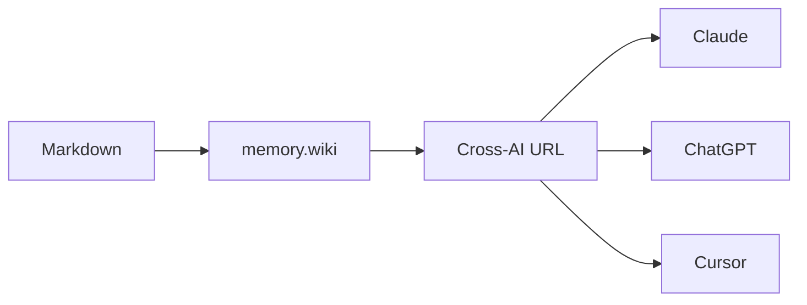
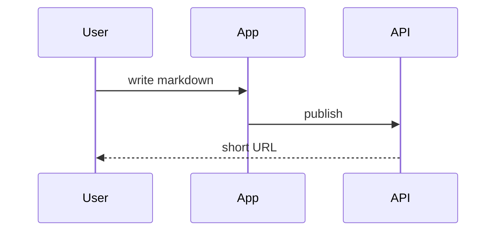
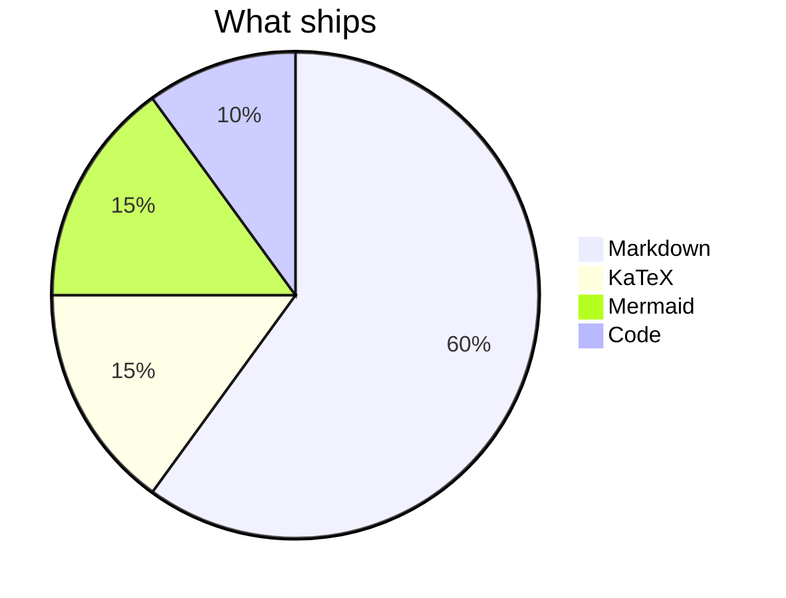

# Mermaid diagrams

## Flowchart

```mermaid
graph LR
    A[Markdown] --> B[memory.wiki]
    B --> C[Cross-AI URL]
    C --> D[Claude]
    C --> E[ChatGPT]
    C --> F[Cursor]
```

## Sequence

```mermaid
sequenceDiagram
    User->>App: write markdown
    App->>API: publish
    API-->>User: short URL
```

## Pie

```mermaid
pie title What ships
    "Markdown" : 60
    "KaTeX" : 15
    "Mermaid" : 15
    "Code" : 10
```
